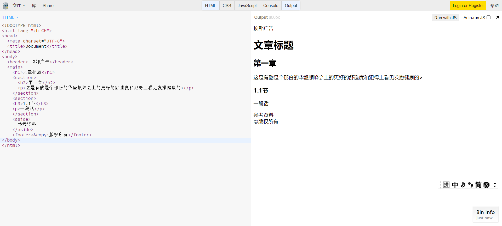

### 英语小课堂
heading 标题   body 正文   paragraph 段落   section 

章、节   article 一篇文章   main 主要   aside 旁边的  

 anchor 锚、定点   strong 重要、强壮  emphasis 强   
 
 调、重读   ordered 有序的   unordered 无序的   
 
 description 描述   term 术语   date 数据   quote 引用
 
   block 块   inline 行内  break 打断

 ###  <!DOCTYPE html>
文档类型
<html lang="en">

  lang语言，我们使用zh-CH
  <head>
    <meta charset="UTF-8" />

    字符编码
    <meta name="viewport" content="width=device-width, initial-scale=1.0" />
    <title>我的网页</title>
  </head>
  <body></body>
  起手式只改语言，其他不改，写入内容都在body里面
</html>

### 章节标签

·表示文章/书的层级

·标题h1~h6

·章节 section

·文章

·段落p

·头部header

·脚部footer

·主要内容 main

旁支内容aside

划分div

### 全局属性

·class  给你的标签分一个类    一般来说style放head里

面       [class="middle bordered"]可以简写成.middle  .border

· contenteditable                      用户可以直接编辑页面上的文字任何一个元素被编辑
 
·hidden隐藏章节标签及属性

·id如果这个页面是全局唯一的就用id      如果不是就用class  不到万不得已不用id（id不报错）

·style    style如何看得见    将style放在body里面        【顶

部广告就可以看到】    style分优先级/JS里面会覆盖掉style  

·tabindex  响应事件   按顺序选择内容区域     0 1 2  0是

最后一个访问到的    负1表示不访问该内容区域

·title ！[title诠释（3.png](3.png)   使用开发者工具   white-

space：nowrap（不要换行）   text-overflow：

ellipsis（如果文字出去了就用省略号     overflow：hidden（溢出就省略)

开发器里面style 的边框加粗是user agent stylesheet  默认的     用自己的标签覆盖掉默认的，例：font-size：14px    默认的会被覆盖掉

###  内容标签

·ol+li         ol全称ordered list（有顺序的列表）    li全程list item列表中的一项     ：列表里面只有表格里的内容

·ul+li         ul全称unordered list （没有顺序的列表）  将顺序1234改成小圆点

·dl+dt+dd        输入dl按个+号 （就出来了）      dl全程description list 描述某事件的     dt（t是term一种术语)：描述的谁   dd(date可能是数据）：描述的内容

·pre              多个空格或回车，系统还是会默认一个空！这样就不会看的很累    h2包裹pre，空格或回车就有了

·hr        作分隔线的

·br        换行，打断

·a          敲链接的 <a herf="http://qq.com" target="_black>

·em       强调（它默认为斜体）  语气很重要

·strong      强调（默认加粗）    本身很重要

·code      包裹代码用的，里面的内容（英文）是等宽的   但是它默认的样式是内联元素

·quote    行内引用

·blockquote    内联块节引用

补充其他的：
<h1 style="text-align:center;">标题居中对齐</h1>

创建图片链接:

     border：盒尺寸    0则图片无边框样式
如果要在同一页面跳转的位置不同<a href="#99">跳转第7章</a>
iframe 标签规定一个内联框架，一个框架被用来在当前HTML文档中嵌入另一个文档